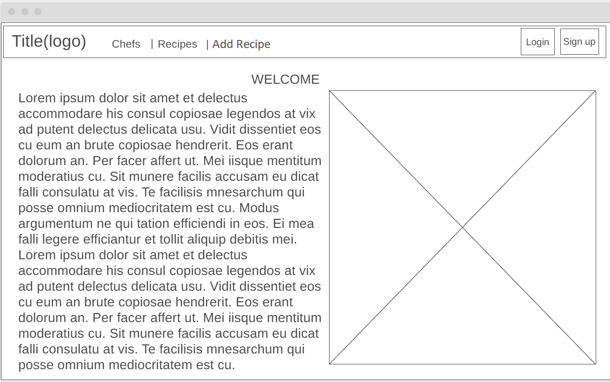
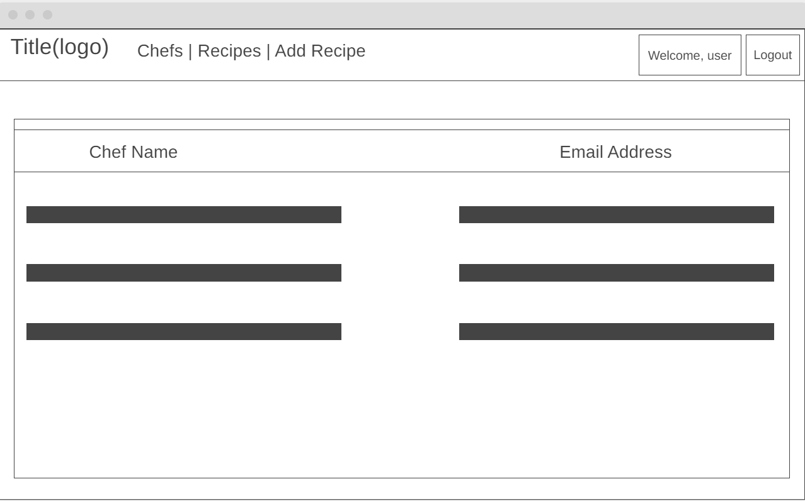
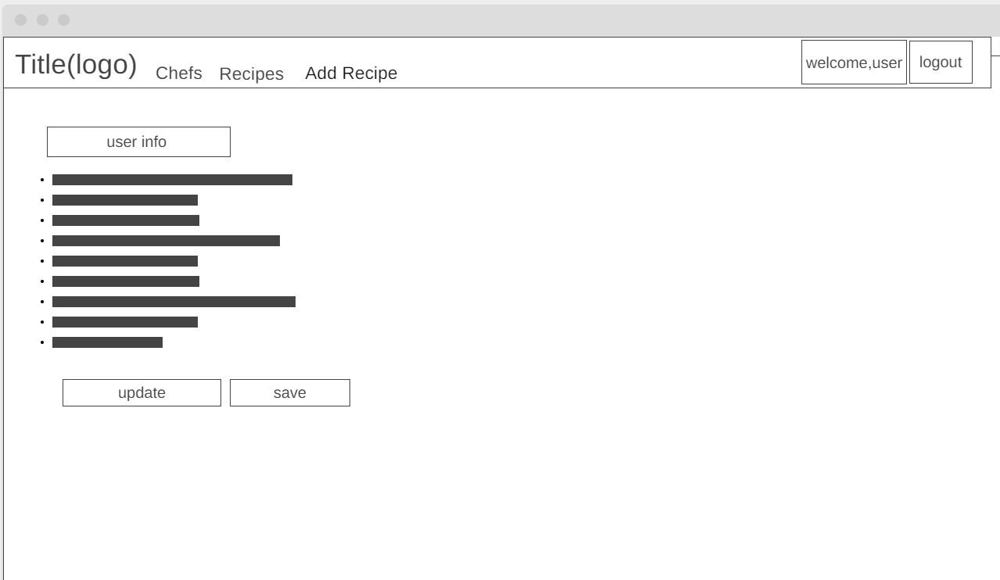
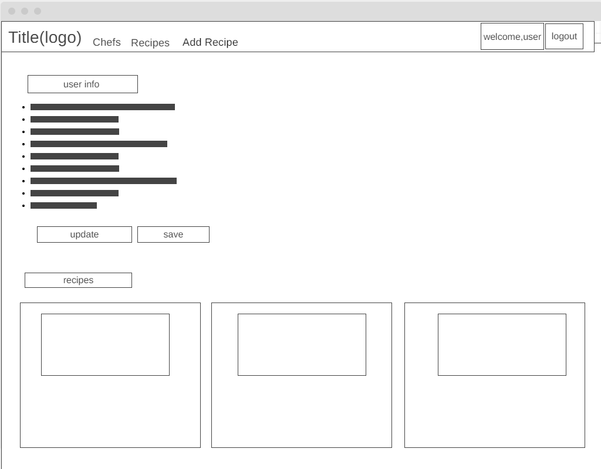
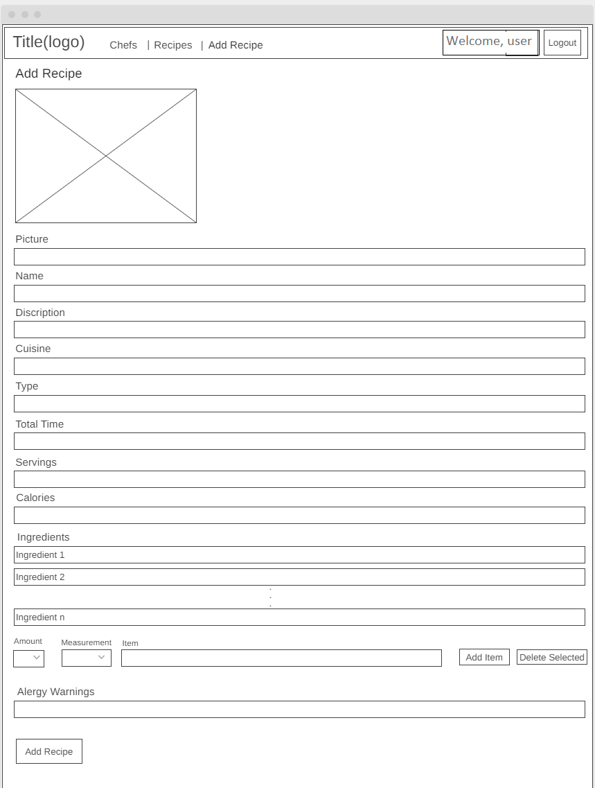

# Chefs App
## Introduction
Chefs app is a website that manages the recipes ...
## Technologies used:
* Spring io
* SQL
* Trello
## General approach:
## Unsolved problems or major hurdles you had to overcome:
## Planning documentation:
We used Trello website as a tool to devide and manage the project's tasks between us.
## Installation instructions for any dependencies:
## Wireframes:

## User stories:
1. As a user, I want to be able to create an account so that I can log in and add and rate recipes.
2. As a user, I want to be able to login into my account so that I can add and rate recipes.
3. As a user, I want to view my details, so I can view my recipes and general information.
4. As a user, I want to be able to view all available recipes, so I can choose what to cook from them.
5. As a user, I want to be able to view the recipe's details, so I can know how to prepare it.
6. As a user, I want to be able to rate the recipe, so I can tell the world what I thought about it.
7. As a chef, I want to be able to add recipes so that I can share my recipe with the world.
8. As a chef, I want to edit my recipe so that I can correct any mistakes  I find.
9. As a chef, I want to delete my recipe so that I can remove any recipe I don't want to share anymore.

